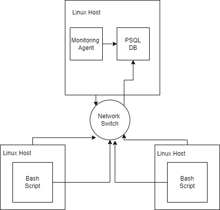

# Linux Cluster Monitoring Agent

# Introduction

This project creates a linux monitoring agent that logs various specifications of the vm server hardware over specified intervals. The vm server is a Linux Rocky 9 instance thats runs on GCP. The log information and history are kept on a PSQL db that runs on a docker container. The creation of the db, the creation of the tables within it, and the creation of the docker container are all automated with scripts.

# Quick Start

```
# Start a psql instance using psql_docker.sh
./psql_docker.sh create db_username db_password

./psql_docker.sh start

# Create Tables using ddl.sql
# Assume db is created and named host_agent
psql -h localhost -U postgres -d host_agent -f sql/ddl.sql

# Insert hardware specs data into the DB using host_info.sh
./host_info.sh psql_host psql_port db_name psql_user psql_password

# Insert hardware usage data into the DB using host_usage.sh
./host_usage.sh psql_host psql_port db_name psql_user psql_password

# Crontab setup
# Replace /home/rocky/dev/jrvs/bootcamp/linux_sql/host_agent/scripts/host_usage.sh with path to host_usage.sh
crontab -e

* * * * * bash /home/rocky/dev/jrvs/bootcamp/linux_sql/host_agent/scripts/host_usage.sh localhost 5432 host_agent postgres password > /tmp/host_usage.log

```

# Implemenation
This project runs on a vm of a rocky 9 linux instance. The logging portion (see crontab in previous section) runs every minute.  

## Architecture


## Scripts

### psql_docker.sh
This script creates, starts, or stops a docker container based on the parameter you give it.

Usage:
```
./psql_docker.sh create db_username db_password

./psql_docker.sh start

./psql_docker.sh stop
```
### host_info.sh
This script collects hardware specification data and then inserts the data into the psql instance. Hardware specifications are static, so the script will be executed only once. 

Usage:
```
./host_info.sh psql_host psql_port db_name psql_user psql_password
```

### host_usage.sh
This script collects server usage data and then inserts the data into the psql database. The script will be executed every minute using Linux’s crontab program.

Usage: 
```
./host_usage.sh psql_host psql_port db_name psql_user psql_password
```

### crontab
This automates the host_usage.sh script to run every minute. 

Usage:
```
# Replace /home/rocky/dev/jrvs/bootcamp/linux_sql/host_agent/scripts/host_usage.sh with path to host_usage.sh
* * * * * bash /home/rocky/dev/jrvs/bootcamp/linux_sql/host_agent/scripts/host_usage.sh localhost 5432 host_agent postgres password > /tmp/host_usage.log
```
### queries.sql 
This file contains sql queries that are commonly run. Store queries here for resuability. 

## Database Modeling

### `host_info`
Column Name       | Data Type
++++++++++++++++++++++++++++++++++++++++++++
 id               | integer                             
 hostname         | character varying            
 cpu_number       | smallint                    
 cpu_architecture | character varying           
 cpu_model        | character varying           
 cpu_mhz          | double precision            
 l2_cache         | integer                     
 timestamp        | timestamp without time zone 
 total_mem        | integer                     

Indexes:
    "host_info_pk" PRIMARY KEY, btree (id)
    "host_info_un" UNIQUE CONSTRAINT, btree (hostname)

Referenced by:
    TABLE "host_usage" CONSTRAINT "host_usage_host_info_fk" FOREIGN KEY (host_id) REFERENCES host_info(id)

  
### `host_usage`

Column Name    | Data Type
++++++++++++++++++++++++++++++++++++++++++++
timestamp      | timestamp without time zone 
host_id        | integer                    
memory_free    | integer                             
cpu_idle       | smallint                    
cpu_kernel     | smallint                    
disk_io        | integer                    
disk_available | integer   

# Test
To test ddl:
- Try switching to host agent, if an error occurs then the program will exit. 
- Try creating host_info table. If it already exists, an error message will pop up thats says so. If any other error occurs, the program will notify you anf exit the process.
- Try creating host_usage. Same process will occur as creating host_info table.

To test crontab:
Try running the host_usage.sh script and compare it against the host_usage table. The table should have entry added every minute. 

# Deployment
The monitoring agent was deployed on a docker container that was hosted on a vm running Rocky Linux 9. The code for all the required files and setup is hosted on github.  

# Improvements
- Coud handle hardware updates in the future
- If more programs are added in the future, could monitor their system usage
- Could also monitor git usage and history, have a table dedicated to it. 
